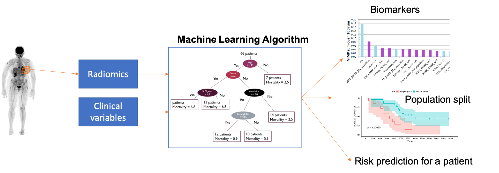

| | :Multimodal Imaging and Learning for Computional-based Medicine (MILCOM) Chair: |

 
The following projects have been supported in part by the European Regional Development
Fund (FEDER), the Pays de la Loire region on the Connect Talent scheme and Nantes Métropole (Convention 2017-10470).

### Survival Analysis, PET images and Machine Learning 

This project points to the development of machine learning algorithms to assist the diagnosis and personalized treatment of patients suffering from hematological diseases such as multiple myeloma or diffuse large B-cell lymphoma (DLBCL) patients. In particular, we aim to *predict a patient's prognosis or treatment response given their full-body PET images*, possibly combined with clinical data. To this end, we have proposed several types of approaches: 

[Graph Neural Networks for survival analysis](/projects/petsurv.md#graph-neural-networks-for-survival-analysis)

[Deep Learning and self-supervised learning ](/projects/petsurv.md#deep-learning-and-self-supervised-learning)

[Random Survival Forests Framework](/projects/petsurv.md#random-survival-forests-framework)

These works are done in close collaboration  with the Nuclear Medicine department of the CHU Nantes and the INSERM CRCINA team 2. They also contribute to the SIRIC ILIAD.

---
### Image Reconstruction and Deep Neural Models

[Diffusion Models for Ultrasound Image reconstruction](/projects/reco.md#diffusion-models-for-ultrasound-image-reconstruction)

[Deep Image Priors for PET Image reconstruction](/projects/reco.md#deep-image-priors-for-pet-image-reconstruction)

---
### Learning with small datasets and few (or no) annotations

[Volumetric Segmentation / MR and ultrasound ](/projects/segment.md)

[Curriculum and Federated Learning / Fracture Classification / X-ray](/projects/curriculum-federated)

[Deep Image Regularization for Image Registration](/projects/dipreg) Industrial Collaboration with [KEOSYS](https://www.keosys.com)

---

### Early Breast Cancer Detection
Industrial Collaboration [HERAMI](https://www.hera-mi.com/en/)

[Multiscale Graph Neural Networks](/projects/mammo)

[Weakly Supervised and Multitask Learning for Anomaly Detection](/projects/mammo)

---

Page template forked from <a href="https://github.com/evanca/quick-portfolio">evanca</a>

<!-- Remove above link if you don't want to attibute -->
