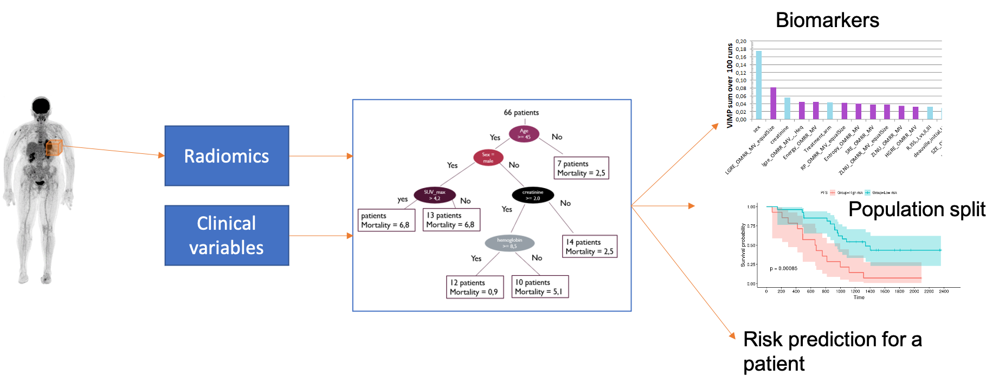

| | <b> Multimodal Imaging and Learning for Computional-based Medicine (MILCOM) Chair </b>|

 
My research activities center around medical image analysis through signal processing, machine learning, and computer vision techniques. 
Since 2018 I have been the holder of the MILCOM Chair. MILCOM aims to design machine-learning methods that explicitly consider the challenges of medical imaging data such as dealing with large volumes,  multi-modal and heterogenous data,  small and imbalanced databases, and/or limited access to expert annotations. 

### Survival Analysis, PET images and Machine Learning 

This project points to the development of machine learning algorithms to assist the diagnosis and personalized treatment of patients suffering from hematological diseases such as multiple myeloma or diffuse large B-cell lymphoma (DLBCL) patients. In particular, we aim to *predict a patient's prognosis or treatment response given their full-body PET images*, possibly combined with clinical data. To this end, we have proposed several types of approaches: 

[Graph Neural Networks for survival analysis](/projects/petsurv/#graph-neural-networks-for-survival-analysis)

[Deep Learning and self-supervised learning ](/projects/petsurv)

[Random Survival Forests Framework](/projects/petsurv)

These works are done in close collaboration  with the Nuclear Medicine department of the CHU Nantes and the INSERM CRCINA team 2. They also contribute to the SIRIC ILIAD.

---
### Image Reconstruction and Learning

[Project 3 Title](http://example.com/)

---
### Learning with small datasets and few annotations

[Project 3 Title](http://example.com/)

---

### Industrial Collaborations

- [HERAMI](http://example.com/)
- [KEOSYS](http://example.com/)

---

[Graph-based survival learning](/pdf/sample_presentation.pdf)
[Deep Learning and self-supervised learning ](/sample_page)
[Random Survival Forests Framework](http://example.com/)

---

Page template forked from <a href="https://github.com/evanca/quick-portfolio">evanca</a>

<!-- Remove above link if you don't want to attibute -->
