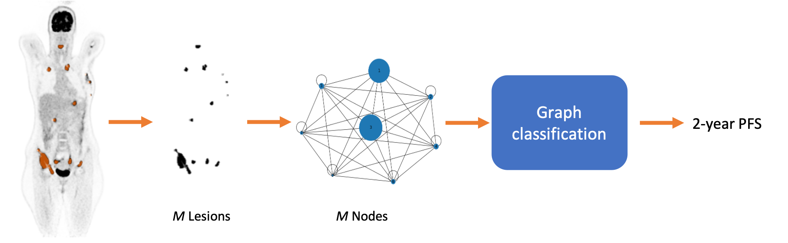
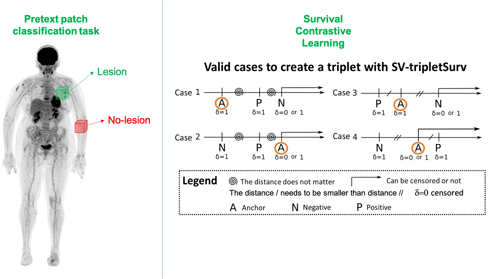

## Survival Analysis and Treatment Response Prediction from PET Images

[Back to the main page](https://dcml-cn.github.io/)

*Clinical/Physics Colaborators:* Françoise Bodéré, Thomas Carlier, Clément Bailly; Caroline M Bodet-Milin

### Graph Neural Networks for survival analysis
*SIMS Colaborator:* Mira Rizkallah
*PhD Candidate:* Oriane Thiery (2022-2025) - Funded by: [AIby4](https://aiby4.ls2n.fr) and [Region Pays de la Loire]()
*Master student:* Aswathi (2022)

We propose multi-lesion graphs to caracterise full-body PET images of diffuse large-B-cell lymphoma (DLBCL) patients, instead of single lesion or full image approaches, graphs explicitely model the varibilities in size and number of lesions. Relying on a Graph-Attention-Network (GAT) on top of the multi-lesion attributed graph, and based on a prospective dataset of more than 500 patients, we provide estimages for the 2-year progression free survival of DLBCL patients [[ISBI2023]](#isbi2023). We have further adapted and extended this approach with a *multi-modal self-attention* block to integrate clinical tabular data within the prediction [[AI4Treat@MICCAI2023]](#ai4treat2023)

* <a id="ai4treat2023">[AI4Treat@MICCAI2023]</a>
  Oriane Thiery, Mira Rizkallah, Gauthier Frecon, Cl´ement Bailly, Caroline M Bodet-Milin, Olivier Casasnovas, Steven Le Gouill, Kraeber-Bodere Francoise, Thomas Carlier, and Diana Mateus.
  In AI4Treat Workshop with MICCAI 2023

* <a id="isbi2023">[ISBI2023]</a>
  Aswathi, Mira Rizkallah, Gauthier Frecon, Cl´ement Bailly, Caroline M Bodet-Milin, Olivier Casasnovas, Steven Le Gouill, Kraeber-Bodere Francoise, Thomas Carlier, and Diana Mateus.
  Lesion graph neural networks for 2-year progression free survival classification of Diffuse Large B-Cell Lymphoma patients.
  In International Symposium on Biomedical Imaging (ISBI), Cartagena de Indias, Colombia, April 2023.

---
### Self-supervised and Multi-task Learning 

*Phd Candidate:* Ludivine Morvan (2018-2021)
*Postdoc:* Khac Lan Nguyen (2021-2022)

We initially explored shallow neural networks with spatial and channel attention blocks [[Prime@MICCAI2020]](#prime2020). We then studied  existing and new formulations of the survival cost function to train neural network and proposed two **self-supervised pretraining** strategies to cope with the small database size [[TRPMS2023]](#trpms2023). These results were the outcome of Ludivine Morvan Ph.D. (2018-2021).  We have also considered a full-body PET imaging approach, which does not require lesion segmentation [[MIC2022]](#mic2022) in the context of Khac Lan Nguyen postdoc (2021-2022).

As a byproduct of the above results, we have started a collaboration for the PET image analysis of  cardiovascular applications.  Recently,  the results of Gauthier Frecon (engineer, 2021-2022) in this direction, have been published in \footnote{\bibentry{godefroy2023jacc}}.

* <a idref="tprms20023">[TRPMS2023]</a>
  Ludivine Morvan, Cristina Nanni, Anne-Victoire Michaud, Bastien Jamet, Cl´ement Bailly, Caroline Bodet-Milin, Stephane Chauvie, Cyrille Touzeau, Philippe Moreau, Elena Zamagni, Francoise Kraeber-Bod´er´e, Thomas Carlier, and Diana Mateus.
  Multiple myeloma prognosis from pet images: Deep survival losses and contrastive pre-training.
  IEEE Transactions on Radiation and Plasma Medical Sciences, 2023.
  *doi:* [10.1109/TRPMS.2023.3283562](https://doi.org/10.1109/TRPMS.2023.3283562)

* <a idref="mic2022">[MIC2022]</a>
  K.L. Nguyen, Bastien Jamet, Clement Bailly, Caroline Bodet-Milin, Francoise Kraeber-Bod´er´e, Philipe Moreau, Cyrille Touzeau, Thomas Carlier, and Diana Mateus. A multi-task learning approach for prediction of treatment response in multiple myeloma.
  *In IEEE Nuclear Science Symposium, Medical Imaging Conference*,
  number M-19-05, November 2022.

* <a idref="prime2020">[Prime@MICCAI2020]</a>
  Ludivine Morvan, Cristina Nanni, Anne-Victoire Michaud, Bastien Jamet, Cl´ement Bailly, Caroline Bodet-Milin, Stephane Chauvie, Cyrille Touzeau, Philippe Moreau, Elena Zamagni, Francoise Kraeber-Bod´er´e, Thomas Carlier, and Diana Mateus. Learned deep radiomics for survival analysis with attention.
  *In International MICCAI Workshop on PRedictive Intelligence In MEdicine PRIME*, Springer, October 2020.

--
### Random Survival Forests and Machine Learning Frameworks

Based on a classical processing of feature extraction from tumor regions in the images followed by a random survival forest for the prognosis predictions. The main technical contribution of this work is the conception of an unified machine learning framework  capable of automatic feature and model selection to optimize the risk predictions. This work was among the first in combining patient and PET image data for prognosis prediction in the context of multiple myeloma, and to link quantitative features(radiomics) to the risk for multiple myeloma [[IJCARS 2019]](#ijcars2019). The benefits were further demonstrated on two prospective clinical datasets [[EJNMMI2020]](#jamet2020). 

* <a id="jamet2020">[EJNMMI2020](https://doi.org/10.1007/s00259-020-05049-6)</a>
  Bastien Jamet, Ludivine Morvan, Cristina Nanni, Anne-Victoire Michaud, Cl´ement Bailly, St´ephane Chauvie, Philippe Moreau, Cyrille Touzeau, Elena Zamagni, Caroline Bodet-Milin, Francoise Kraeber-Bod´er´e, Diana Mateus, and Thomas Carlier.
  Random survival forest to predict transplant-eligible newly diagnosed multiple myeloma outcome including FDG-PET radiomics: a combined analysis of two independent prospective european trials.
  *European Journal of Nuclear Medicine and Molecular Imaging*
  2021.
  *doi:* [10.1007/s00259-020-05049-6](https://doi.org/10.1007/s00259-020-05049-6)

* <a id="ijcars2019">[IJCARS2019]</a>
  Ludivine Morvan, Thomas Carlier, Bastien Jamet, Clément Bailly, Caroline Bodet-Milin, Philippe Moreau, Francoise Kraeber-Bodéré, and Diana Mateus.
  Leveraging Random Survial Forest and PET images for prognosis of multiple myeloma at diagnosis.
  *Int. journal of computer assisted radiology and surgery 2019*

